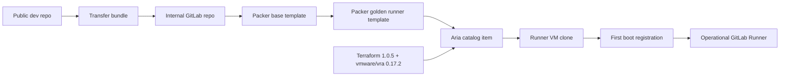

# Architecture

This document describes the current `terraform` branch. It is based on source
code, not the retired Be1/MinIO documents from earlier branches.

## System shape

## Planes

| Plane | Owner | Source files |
| --- | --- | --- |
| Transfer | USB/git bundle/Git LFS CAS | `transfer/*.ps1`, `.gitattributes` |
| Base image | Packer `vsphere-iso` | `packer/base/*` |
| Golden image | Packer `vsphere-clone` and PowerShell phases | `packer/golden/*`, `provisioners/Invoke-Phase.ps1`, `phases/*` |
| Deployment | Terraform through Aria Service Broker | `terraform/*`, `module/aria-vm/*` |
| First boot identity | In-guest PowerShell | `provisioners/Register-RunnerFirstBoot.ps1` |
| Validation | CI and in-guest gates | `.gitlab-ci.yml`, `.claude/verify-ps.ps1`, `validation/*`, `scripts/Test-AriaTerraformPreflight.ps1` |

## Build lifecycle

1. `packer/base/base.pkr.hcl` creates a WS2019 base VM from ISO.
2. The base build enables OpenSSH from `tools/openssh/OpenSSH-Win64.zip`.
3. `packer/golden/golden.pkr.hcl` clones the base template.
4. Packer uploads the repo to `C:\provision`.
5. Packer runs:
   - `Invoke-Phase.ps1 -Phase 1`
   - `windows-restart`
   - `Invoke-Phase.ps1 -Phase 2`
   - `windows-restart`
   - `Invoke-Phase.ps1 -Phase 3`
6. Phase 3 writes a token-less runner config skeleton and installs the first-boot
   registration script.
7. Phase 3 runs the build-gate validation before the image can become a template.

Packer owns reboot sequencing. The old `3010` self-reboot contract is not used.

## Deploy lifecycle

Terraform does not clone vSphere VMs directly. It resolves an existing Aria
project and catalog item, then creates a `vra_deployment` using string-only
`vm_inputs`.

The Aria catalog item is responsible for mapping those inputs into the real VM
shape: CPU, memory, disks, network, template selection, and guestinfo keys.

First boot then runs `Register-RunnerFirstBoot.ps1` as SYSTEM. It:

1. Loads `Config.ps1`, `Common.ps1`, and `Invoke-FinalValidation.ps1` from
   `C:\GitLab-Runner`.
2. Reads identity from VMware guestinfo, machine/process env, or
   `C:\GitLab-Runner\firstboot.json`.
3. Initializes an attached raw data disk as `E:` when available.
4. Moves Docker data from the baked C: root to the data drive when possible.
5. Converts a PAT/registration token to a `glrt-` runner auth token, or accepts
   a pre-created `glrt-` token directly.
6. Writes final `config.toml`.
7. Installs and starts the runner service with explicit `--working-directory`
   and `--config`.
8. Runs the deploy-gate validation.
9. Writes `.firstboot_complete` only after the runner is operational.

## Runtime layout

| Path | Purpose |
| --- | --- |
| `C:\GitLab-Runner` | Runner binary, config, logs, scripts, staged libs, markers. |
| `C:\GitLab-Runner\scripts` | Maintenance and first-boot scripts. |
| `C:\GitLab-Runner\logs` | Provisioning, job, network, health, and diagnostic logs. |
| `C:\Tools` | Installed support tools and observability binaries. |
| `E:\docker-data` | Preferred Docker data root after first boot. |
| `E:\GitLab-Runner\builds` | Preferred runner builds directory. |
| `E:\GitLab-Runner\cache` | Preferred runner cache directory. |

If no valid fixed NTFS data drive is available, the code falls back to C:. That
fallback is useful for testing but should be treated as a production warning.

## Retired architecture

The following are intentionally not part of the Terraform branch runtime:

- MinIO/S3 script download during provisioning.
- Harbor as the image registry.
- Be1 as the phase orchestrator.
- `Bootstrap-GitLabRunner.ps1` as an active installer.
- Runner registration during image build.

Some source variable names still include `S3Keys` for compatibility, but their
values are repo-relative artifact paths.
